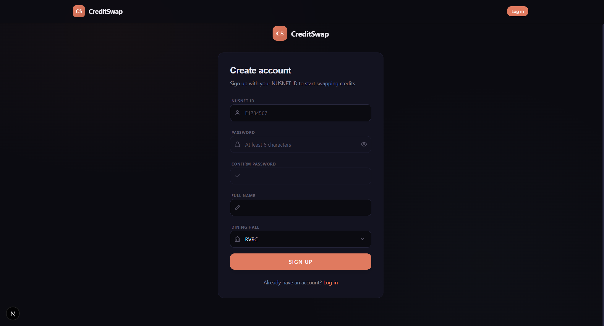
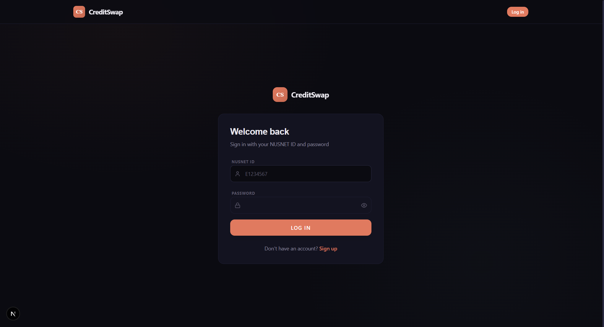
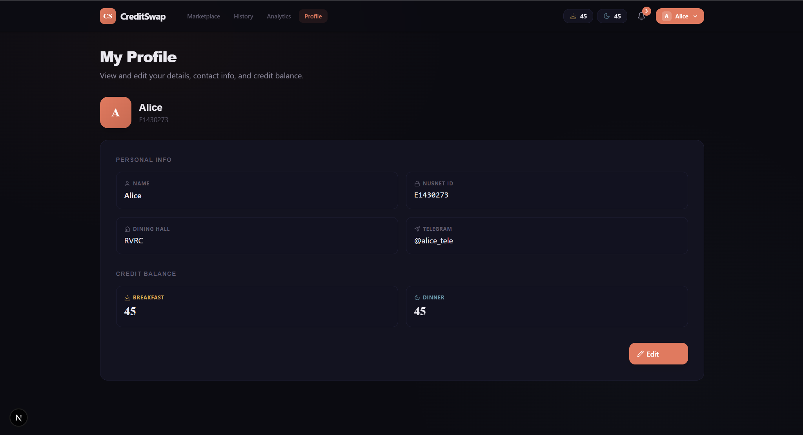
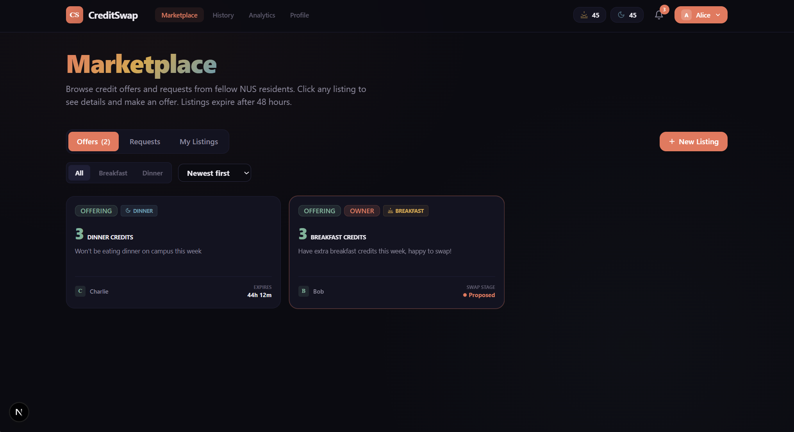
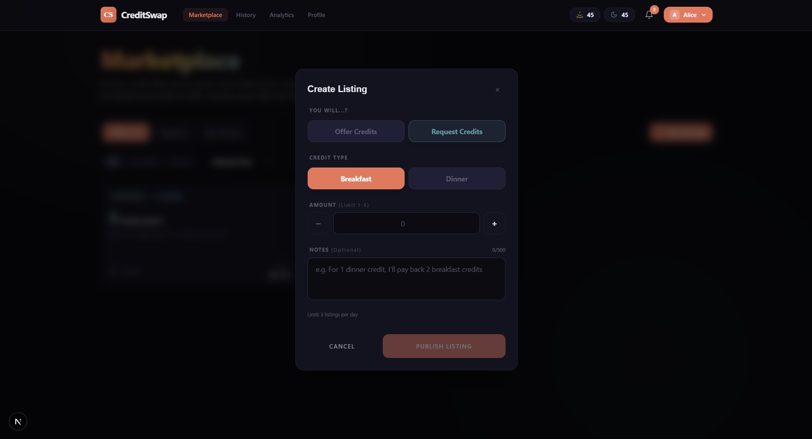
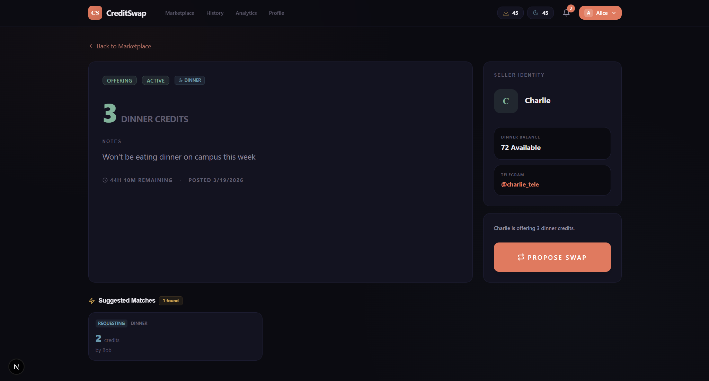
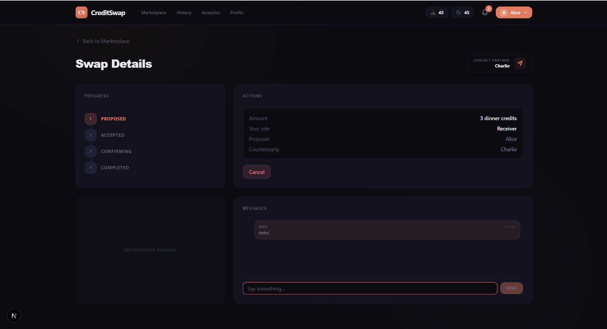

# CreditSwap

A peer-to-peer dining credit marketplace for NUS residential college students. Students can list excess meal credits (breakfast or dinner), browse listings from their dining hall, propose swaps, and confirm transfers — all through a clean, real-time web interface.

## Features

- **Listings marketplace** — Create offers or requests for breakfast/dinner credits, filtered by dining hall and credit type, with 48-hour auto-expiry and daily rate limiting
- **Swap workflow** — Propose, accept, and dual-confirm swaps with atomic credit transfers and balance validation
- **In-app messaging** — Chat with counterparties within each swap to coordinate details
- **Authentication** — Sign up and log in with NUSNET ID and password (bcrypt-hashed)
- **Profile management** — View/edit personal info, dining hall, Telegram handle, and credit balances; dining hall changes auto-cancel active swaps with user confirmation

## Tech Stack

- **Frontend:** Next.js 16, React 19, TypeScript, Tailwind CSS 4
- **Backend:** Next.js API routes, Zod validation, middleware auth
- **Database:** SQLite via Prisma ORM
- **Auth:** bcryptjs password hashing, httpOnly secure cookies

## Setup Instructions

### Prerequisites

- **Node.js** 18+ and npm (or yarn/pnpm/bun)
- **Git** (for cloning)

### 1. Clone and install dependencies

```bash
git clone <your-repo-url>
cd resi-hack
npm install
```

### 2. Set up the database

The app uses SQLite with Prisma. Copy `.env.example` to `.env` (or set `DATABASE_URL` yourself — paths are relative to `prisma/schema.prisma`).

```bash
# Generate Prisma client and run migrations
npx prisma generate
npx prisma migrate dev

# Seed demo users for testing
npx tsx prisma/seed.ts
```

### 3. Run the development server

```bash
npm run dev
```

Open [http://localhost:3000](http://localhost:3000) on Google Chrome.

### Demo Accounts

| Name    | NUSNET ID  | Password      | Dining Hall |
|---------|------------|---------------|-------------|
| Alice   | E1430273   | password123   | RVRC        |
| Bob     | E1837291   | password123   | RVRC        |
| Charlie | E1038391   | password123   | RVRC        |
| David   | E1182743   | password123   | Cendana     |

### 4. Build for production (optional)

```bash
npm run build
npm start
```

---

## User Guide

### Sign up

1. Go to **Sign up** (or `/signup`).
2. Enter your **NUSNET ID** (e.g. E1234567), **password**, **full name**, and **dining hall**.
3. Click **Sign up**. You'll be logged in and redirected to the marketplace.



### Log in

1. Go to **Log in** (or `/login`).
2. Enter your **NUSNET ID** and **password**.
3. Click **Log in**.



### Profile

1. Click **Profile** in the navbar (requires login).
2. View your **name**, **NUSNET ID**, **dining hall**, **Telegram handle**, and **credit balance**.
3. Click **Edit** to update your Telegram handle and credit balance.



### Browse the marketplace

1. On the home page, use the tabs: **Offers**, **Requests**, or **My Listings**.
2. Filter by **Breakfast** or **Dinner** credits.
3. Sort by **Newest first** or **Expiring soon**.
4. Click a listing card to open its details.



### Create a listing

1. Click **+ New Listing** (requires login).
2. Choose **Offer** (you have credits to give) or **Request** (you need credits).
3. Select **Breakfast** or **Dinner**, enter the **amount** (1–3 credits), and add optional **notes**.
4. Click **Create**. Listings expire after 48 hours.



### Propose a swap

1. Open a listing you're interested in.
2. Review the seller/buyer info and credit balance.
3. Click **Propose Swap**.
4. You'll be taken to the swap page to coordinate with the other party.



### Complete a swap

1. On the **Swap Details** page, use the **Progress** timeline to see the current status.
2. Use **Actions** to **Accept**, **Cancel**, or **Confirm** the swap.
3. Use **Messages** to coordinate with your swap partner.
4. The **giver** (person transferring credits) follows the on-screen instructions to complete the transfer.
5. Both parties confirm to mark the swap as **Completed**.



---

| Command | Description |
|---------|-------------|
| `npm run dev` | Start development server |
| `npm run build` | Build for production |
| `npm start` | Run production server |
| `npm run db:seed` | Seed demo users and listings |
| `npm run db:reset` | Reset database and re-run migrations |

## Project Structure

```
src/
├── app/
│   ├── api/           # API routes (auth, listings, swaps, profile)
│   ├── listing/[id]/  # Listing detail page
│   ├── swap/[id]/     # Swap detail + messaging page
│   ├── login/         # Login page
│   ├── signup/        # Signup page
│   ├── profile/       # Profile view/edit page
│   └── page.tsx       # Home — marketplace listings
├── components/        # Reusable UI components
├── lib/               # Auth, DB, constants, validations, formatting
├── providers/         # AuthProvider context
└── types/             # TypeScript interfaces
prisma/
├── schema.prisma      # Database schema
├── seed.ts            # Demo data seeder
└── migrations/        # SQL migrations
```

---

## Team

Built for the NUS Residential College Hackathon 2026.

